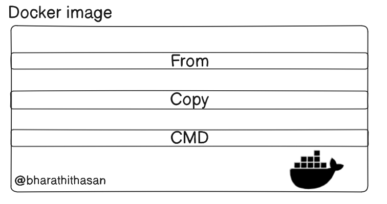

<h1> What is docker image and how to create a docker file & docker containor </h1>

```
FROM python:3.8-slim
CMD ["python","-c","print("hello world")"]

```

## Docker image build command

``` 
sudo docker build -t python-helloworld:latest

```

## Docker containor run command

```
sudo docker run python-helloworld:latest

```

## Docker file explaination

## Baseimage retrieval

### The FROM instruction specifies the base image (e.g., python:3.9-slim), which could be an operating system or language runtime (like Python)

# Layered Filesystem

## Layered file system is a union file system

### FROM: Creates the first layer (the base image).
### COPY: Adds files to the image, creating another layer.
### RUN: Executes commands in the image and creates another layer.

## These layers are cached so that if the build process is repeated and nothing has changed in the Dockerfile, Docker can reuse the cached layers. This speeds up future builds.

## Architecture : 


### Storing the Image
#### Docker stores the resulting image in its local image repository (stored on your machine, typically under /var/lib/docker).
#### The image is immutable, meaning it cannot be modified. Any changes to it would result in a new layer.