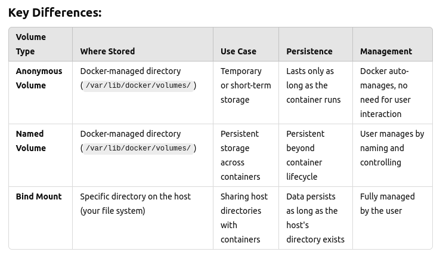

# Docker Volume

__A Docker volume is a persistent storage mechanism in Docker that allows data to be stored and shared between containers or retained even after a container is removed. Volumes are a key part of Docker's containerization because containers are typically ephemeral, meaning their file systems are temporary and do not persist beyond the container's lifecycle.__

## Why use volumes?

- Persistence: Data stored in a volume survives container restarts or removal.

- Sharing data: Volumes allow multiple containers to share data. For example, a database container can store its data in a volume, and other containers can access that data if needed

- Performance: Volumes are designed to handle I/O efficiently, especially when working with large data sets.

## Types of volumes

- Anonymous Volumes

- Named Volumes

- Bind Mounts

## 

