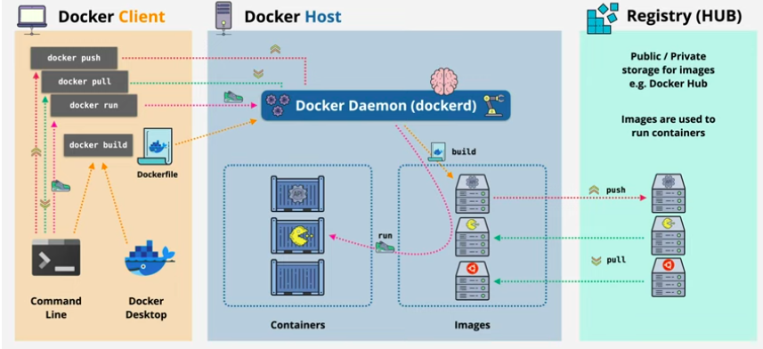

## docker basic to advance

## what is docker ?
### docker is a tool that enables developers to create deploy and run applications in containers
containers are light wight .

### why containers are light wight ?
#### shared os kernel  
#### fast startup times 
#### the layered file system

# docker architecture 

